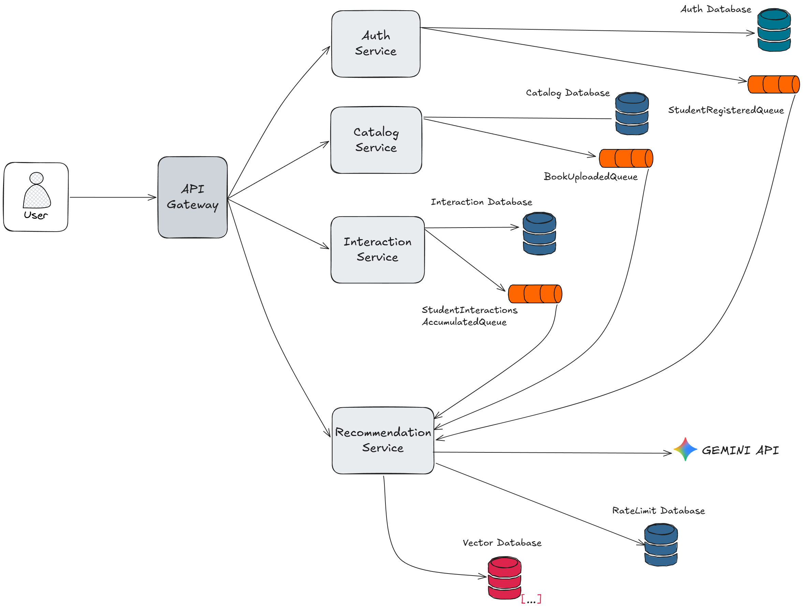

<div align="center">

# Library Information Recommendation System


</div>

## Overview

A microservices-based system that delivers personalized book recommendations to
students at **Universidad de los Llanos (Unillanos)**. Bibliographic metadata is
sourced from the library's online public catalog, while career and subject
information reflects the academic offerings available as of the repository's
publication date. The system combines student profile data, behavioral
interactions, and AI-generated semantic embeddings using Google Gemini API, with
similarity search powered by Qdrant vector database.

## Architecture



| Service | Description | Port | Technologies |
|---|---|---|---|
| **API Gateway** | Single entry point for all clients. Handles reverse proxying (YARP), JWT token validation, rate limiting, and CORS policy enforcement | 5075 | YARP, .NET 10 / ASP.NET Core |
| **Auth Service** | Handles user authentication (JWT), admin and student registration, and provides read-only access to careers and subjects (seeded data) | 5132 | MySQL, .NET 10 / ASP.NET Core |
| **Catalog Service** | Offers read-only book catalog endpoints (list, search, detail) and batch import of bibliographic records from ISO-2709 files | 5281 | PostgreSQL, .NET 10 / ASP.NET Core |
| **Interaction Service** | Tracks student behavior and accumulates interactions. Supports interaction types (`VIEW`, `SEARCH`, `FAVORITE`, `UNFAVORITE`) and publishes batched events for the recommendation pipeline | 5144 | PostgreSQL, RabbitMQ, .NET 10 / ASP.NET Core |
| **Recommendation Service** | Generates semantic embeddings for both books and student profiles via Google Gemini API, stores vectors in Qdrant, updates student profiles from interactions, and computes top-N book recommendations using cosine similarity | 5221 | Qdrant, Gemini API, PostgreSQL, .NET 10 / ASP.NET Core |

## Key Features

- **Clean Architecture** — each service follows Domain / Application / Infrastructure / API layering, keeping concerns separated and testable.

- **Event-driven architecture** — all services communicate asynchronously via RabbitMQ. Student registrations, book uploads, and interaction accumulations are published as events consumed by the Recommendation Service, decoupling the pipeline.

- **JWT-based authentication with role management** — supports admin registration and student registration (by admin). Login returns a JWT used to authenticate all subsequent requests across services.

- **Book catalog with ISO-2709 bulk import** — ingest bibliographic records from standard ISO-2709 (MARC) files. The parser extracts ISBN, title, language, summary, year, authors, and topics. Duplicate detection prevents re-importing existing records. Each imported book triggers a `BookUploadedEvent` so the recommendation engine is kept in sync.

- **Student interaction tracking** — logs student behavior including `VIEW` (viewing a book detail), `SEARCH` (searching the catalog), `FAVORITE`, and `UNFAVORITE`. Interactions are accumulated and periodically published as `StudentInteractionsAccumulatedEvent` for profile updating.

- **AI-powered recommendations with semantic embeddings** — when a student registers, their academic profile (career and subjects) is converted into a text description and published as a `StudentRegisteredEvent`. The Recommendation Service generates a vector embedding via Google Gemini API and stores it in Qdrant. Book embeddings are generated the same way upon import.

- **Adaptive student profiles** — as interaction events accumulate, the student's profile vector is updated using a weighted alpha approach (each interaction type has a configurable weight: `VIEW` = 1.0, `SEARCH` = 0.5, `FAVORITE` = 2.0, `UNFAVORITE` = -1.0). This means recommendations evolve with student behavior.

- **Cosine similarity recommendation engine** — when a student requests recommendations, their current profile vector is compared against all book vectors in Qdrant. The top-N most similar books are returned.

- **Rate-limited API** — configurable request limits at the API Gateway and strict Gemini API rate-limit enforcement with automatic pause/resume to stay within quota.


## Prerequisites

- [Docker](https://docs.docker.com/get-docker/) and [Docker Compose](https://docs.docker.com/compose/install/)
- [.NET 10 SDK](https://dotnet.microsoft.com/download/dotnet/10.0) (only for manual setup)
- A [Google Gemini API key](https://aistudio.google.com/app/apikey)

## Getting Started

### 1. Clone the repository

```bash
git clone https://github.com/yourusername/Library-Information-Recommendation-System.git
cd Library-Information-Recommendation-System
```

### 2. Configure environment variables

Copy the example file and edit it:

```bash
cp .env.example .env
```

Below is a description of each variable:

#### JWT configuration

| Variable | Description |
|---|---|
| `Jwt__Key` | Secret key used to sign and verify JWT tokens. Must be a sufficiently long base64-encoded string. |
| `Jwt__Issuer` | Issuer claim for JWT tokens (e.g., `LibraryRecSys.AuthService`). |
| `Jwt__Audience` | Audience claim for JWT tokens (e.g., `LibraryRecSys.Api`). |

#### Interaction accumulation

| Variable | Description |
|---|---|
| `InteractionAccumulation__BatchSize` | Number of individual interactions to accumulate before publishing a batched `StudentInteractionsAccumulatedEvent`. Default: `5`. |

#### Gemini API & Rate limits

| Variable | Description |
|---|---|
| `Gemini__ApiKey` | Your Google Gemini API key. Get one at [Google AI Studio](https://aistudio.google.com/app/apikey). |

The system uses the `gemini-embedding-001` model. On the **free tier**, this model has a limit of **100 requests per minute (RPM)**, **30,000 tokens per minute (TPM)**, and **1,000 requests per day (RPD)**. The `RateLimit__*` variables enforce a safety margin below these quotas to prevent exceeding the available capacity and getting your requests rejected. A safe starting point is **~80% of the free tier limits**, for example: RPM = `80`, TPM = `24000`, RPD = `800`.

> [!IMPORTANT]
> Rate limits vary by plan and region. Always check the [official Gemini rate limits page](https://ai.google.dev/gemini-api/docs/rate-limits) for the most up-to-date values.

| Variable | Description |
|---|---|
| `RateLimit__MaxRpm` | Maximum embedding requests per minute. Default: `50`. |
| `RateLimit__MaxTpm` | Maximum tokens per minute. Default: `10000`. |
| `RateLimit__MaxRpd` | Maximum requests per day. Default: `500`. |

These limits apply globally across the Recommendation Service — when any limit is reached, the system automatically pauses embedding generation and resumes once the quota window resets.

#### Student profile adaptation

| Variable | Description |
|---|---|
| `StudentVector__Alpha` | Smoothing factor for updating the student's embedding vector after each interaction batch. Must be between `0.0` and `1.0`. Default: `0.6`. |

This parameter controls how much weight is given to new interactions versus the student's existing profile when recalculating their vector:

```
new_profile = (1 - α) × current_profile + α × new_interaction_vector
```

- **Higher α (e.g., 0.8)** — new interactions have a stronger impact, making recommendations shift quickly based on recent behavior. Useful for exploratory or session-based systems.
- **Lower α (e.g., 0.3)** — the profile changes slowly, producing more stable recommendations over time. Good when the student's interests are well established.

A value of **0.6** is a balanced default: recent behavior influences the profile but does not override the accumulated history.

### 3. Choose a run mode

#### Option A: Development — Infrastructure only (Docker Compose)

Starts all databases, RabbitMQ, and Qdrant. Run each service manually with `dotnet run` for live reload.

```bash
docker-compose up
```

Then start each service in a separate terminal:

```bash
# Terminal 1
cd src/AuthService/Auth.Api && dotnet run
# Terminal 2
cd src/CatalogService/Catalog.Api && dotnet run
# Terminal 3
cd src/InteractionService/Interaction.Api && dotnet run
# Terminal 4
cd src/RecommendationService/Recommendation.Api && dotnet run
# Terminal 5
cd src/ApiGateway && dotnet run
```

#### Option B: Production — Full stack (Docker Compose)

Builds and runs all services plus infrastructure in containers.

```bash
docker-compose -f docker-compose.prod.yml up --build
```


## API Usage

Once running, all endpoints are accessible through the API Gateway at `http://localhost:5075`.

You can explore the API in two ways:

- **Swagger UI** (Development only): Navigate to `http://localhost:5075/swagger/auth`, `http://localhost:5075/swagger/catalog`, `http://localhost:5075/swagger/interaction`, or `http://localhost:5075/swagger/recommendation`.
- **Postman Collection**: Import the provided collection at `postman/Library Recommendation System API.postman_collection.json`.

> [!NOTE]
> The ISO 2709 test files used for loading bibliographic records are located in the [`books/`](books/) folder. These files were obtained from the public lists (OPAC) of the library management system at **Universidad de los Llanos**: [OPAC Public Shelves](https://unillanos.metacatálogo.org/cgi-bin/koha/opac-shelves.pl?op=list&public=1).

### Endpoints

#### Auth Service

| Method | Route | Auth | Description |
|---|---|---|---|
| POST | `/api/auth/Auth/login` | Public | Authenticate user, return JWT |
| POST | `/api/auth/Auth/registerAdmin` | ADMIN | Register a new admin |
| POST | `/api/auth/Auth/registerStudent` | ADMIN | Register a new student |
| GET | `/api/auth/Student` | ADMIN | Get all students |
| GET | `/api/auth/Student/{id:long}` | Auth | Get student by ID |
| GET | `/api/auth/Career` | Public | Get all careers |
| GET | `/api/auth/Career/{id:int}?semester={int}` | Public | Get career by ID with optional semester filter |

#### Catalog Service

| Method | Route | Auth | Description |
|---|---|---|---|
| GET | `/api/catalog/Books?page={int}&pageSize={int}` | Public | Get paginated books |
| GET | `/api/catalog/Books/search?name={string}` | Auth | Search books by name |
| GET | `/api/catalog/Books/{id:guid}` | Auth | Get book details by ID |
| POST | `/api/catalog/Books/details` | Public | Get multiple books by list of IDs |
| POST | `/api/catalog/UploadBooks/upload` | Auth | Upload ISO 2709 file to import books |

#### Interaction Service

| Method | Route | Auth | Description |
|---|---|---|---|
| POST | `/api/interaction/StudentInteractions` | Public | Save student interaction (SEARCH, VIEW, FAVORITE, UNFAVORITE) |
| POST | `/api/interaction/StudentFavorite/save/{bookId:guid}` | Auth | Save book as favorite |
| GET | `/api/interaction/StudentFavorite/list` | Auth | Get list of favorite books |
| GET | `/api/interaction/StudentFavorite/check/{bookId:guid}` | Auth | Check if book is favorite |
| DELETE | `/api/interaction/StudentFavorite/delete/{bookId:guid}` | Auth | Remove book from favorites |

#### Recommendation Service

| Method | Route | Auth | Description |
|---|---|---|---|
| GET | `/api/recommendation/Recommendations?limit={int}` | Auth | Get personalized book recommendations |

## License

Distributed under the MIT License. See `LICENSE` for more information.
