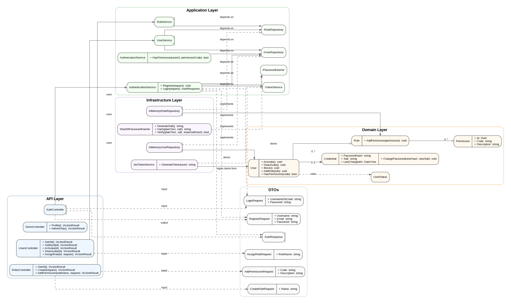

# MiniIdentity API (.NET 10)

A simple ASP.NET Core Web API example for:
- user registration
- login with JWT
- role management
- permission assignment
- protected endpoints with `[Authorize]`

This project is designed as an academic example to explain authentication, authorization, layered architecture, DTOs, in-memory repositories, and token-based access control.

---

## Design UML

The following UML diagram shows the main structure of the solution, including controllers, services, DTOs, domain entities, repositories, and security components.



---

## Architecture

The solution is organized into four main projects:

- **MiniIdentityApi.Api**: exposes HTTP endpoints through controllers and configures Swagger, authentication, and dependency injection.
- **MiniIdentityApi.Application**: contains DTOs, interfaces, and application services.
- **MiniIdentityApi.Domain**: contains the core domain entities and enums.
- **MiniIdentityApi.Infrastructure**: contains in-memory repositories, password hashing, and JWT token generation.
- **MiniIdentityApi.Tests**: contains unit and integration tests for the application.

---

## What each controller does

### AuthController
Handles authentication-related operations.

Endpoints:
- `POST /api/auth/register`: registers a new user with username, email, and password.
- `POST /api/auth/login`: validates credentials and returns a JWT access token.

### UsersController
Handles user administration.

Endpoints:
- `GET /api/users`: returns all users. Requires `Admin` role.
- `GET /api/users/{id}`: returns a user by id. Requires authentication.
- `PATCH /api/users/{id}/activate`: activates a user. Requires `Admin` role.
- `PATCH /api/users/{id}/deactivate`: deactivates a user. Requires `Admin` role.
- `POST /api/users/{id}/roles`: assigns a role to a user. Requires `Admin` role.

### RolesController
Handles role and permission management.

Endpoints:
- `GET /api/roles`: returns all roles. Requires `Admin` role.
- `POST /api/roles`: creates a new role. Requires `Admin` role.
- `POST /api/roles/{roleName}/permissions`: adds a permission to a role. Requires `Admin` role.

### DemoController
Contains protected demo endpoints to validate JWT authentication and role-based access control.

Endpoints:
- `GET /api/demo/profile`: any authenticated user can access.
- `GET /api/demo/admin`: only users with `Admin` role can access.

---

## What each service does

### AuthenticationService
Responsible for registration and login.

Main responsibilities:
- validates input for registration
- verifies whether a user already exists
- hashes the password using a salt
- creates the `Credential` and `User` objects
- validates credentials on login
- checks that the user status is `Active`
- requests a JWT from `ITokenService`

### AuthorizationService
Responsible for checking whether a user has a specific permission.

Main responsibilities:
- loads the user by id
- checks whether the user is active
- delegates permission lookup to the domain model

### UserService
Responsible for user management use cases.

Main responsibilities:
- lists users
- gets a user by id
- activates and deactivates users
- assigns roles to users

### RoleService
Responsible for role and permission management.

Main responsibilities:
- lists roles
- creates roles
- adds permissions to roles

---

## Domain model

### User
Represents the user account.

Main fields:
- `Id`
- `Username`
- `Email`
- `Status`
- `Credential`
- `Roles`

Key behavior:
- activate user
- deactivate user
- block user
- assign a role
- check if the user has a permission through assigned roles

### Credential
Represents the password-related information.

Main fields:
- `PasswordHash`
- `Salt`
- `LastChangedAt`

### Role
Represents a role such as `Admin`, `Teacher`, or `Student`.

Main fields:
- `Id`
- `Name`
- `Permissions`

### Permission
Represents a permission code such as:
- `users.read`
- `users.create`
- `roles.assign`

### UserStatus
Represents the current status of a user:
- `Active`
- `Inactive`
- `Blocked`

---

## Infrastructure components

### InMemoryUserRepository
Stores users in memory using a `List<User>`.

### InMemoryRoleRepository
Stores roles in memory using a `List<Role>`.

### Sha256PasswordHasher
Generates salts, hashes passwords with SHA-256, and verifies passwords.

### JwtTokenService
Builds JWT access tokens using configuration values from `appsettings.json`.

---

## Required NuGet packages

Install these packages in **MiniIdentityApi.Api**:

```bash
dotnet add package Microsoft.AspNetCore.Authentication.JwtBearer
dotnet add package Swashbuckle.AspNetCore --version 10.*
```

---

## Configuration

Add this to `MiniIdentityApi.Api/appsettings.json`:

```json
{
  "Jwt": {
    "Key": "THIS_IS_A_DEMO_KEY_CHANGE_IT_123456789",
    "Issuer": "MiniIdentityApi",
    "Audience": "MiniIdentityApiUsers"
  },
  "Logging": {
    "LogLevel": {
      "Default": "Information",
      "Microsoft.AspNetCore": "Warning"
    }
  },
  "AllowedHosts": "*"
}
```

---

## Important bootstrap note

All role-management and admin-management endpoints require the `Admin` role.
Because of that, the project should include an initial seed or bootstrap strategy for the first administrator.

Recommended options:
1. seed an admin role and admin user when the application starts
2. create a temporary bootstrap endpoint for the first demo
3. temporarily relax admin restrictions only for testing

The cleanest option is **seeding** an initial admin role and admin user.

---

## Suggested execution flow

### Basic flow without admin bootstrap
1. Register a user.
2. Login.
3. Use the JWT to call `/api/demo/profile`.

### Full flow with seeded admin
1. Login as seeded admin.
2. Create roles.
3. Add permissions to roles.
4. Register another user.
5. Assign a role to that user.
6. Test protected endpoints.

---

## Example requests

### Register user
`POST /api/auth/register`

```json
{
  "username": "wolfang",
  "email": "wolfang@example.com",
  "password": "Pass123!"
}
```

### Login user
`POST /api/auth/login`

```json
{
  "usernameOrEmail": "wolfang",
  "password": "Pass123!"
}
```

### Create role
`POST /api/roles`

```json
{
  "name": "Admin"
}
```

### Add permission to role
`POST /api/roles/Admin/permissions`

```json
{
  "code": "users.read",
  "description": "Allows listing users"
}
```

### Assign role to user
`POST /api/users/{id}/roles`

```json
{
  "roleName": "Admin"
}
```

---

## Swagger URL

If the API runs locally, Swagger will usually be available at:

```text
https://localhost:{port}/swagger
```

---

## Postman collection

The Postman files are included in the repository under:

- `postman/MiniIdentityApi.postman_collection.json`
- `postman/MiniIdentityApi.postman_environment.json`

Import both files into Postman.

After importing them, update these variables as needed:
- `baseUrl`
- `jwt`
- `userId`
- `roleName`

---

## Suggested repository structure for docs

```text
docs/
└── uml/
    └── mini-identity-api-uml.png
```

